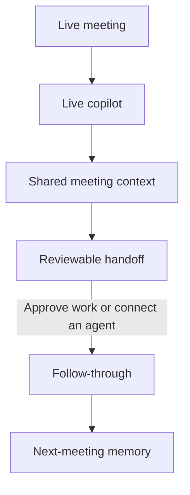

# Meeting Loop

**A macOS meeting copilot for live assistance, shared context and agent-ready follow-through.** Get help with what to say, catch up on the discussion, and ask questions using the meeting transcript and your project's saved work. When the meeting ends, carry that context into a structured handoff so the next agent or approved local workflow can pick up with the sources, decisions and task state intact.

I built Meeting Loop to connect three moments: **help during the conversation, a useful handoff afterward, and informed follow-up in the next meeting**. The implementation combines a floating copilot, local capture and inference, persistent project memory, task review, and interfaces for another assistant to read the context.

## The loop at a glance



**During:** the copilot can suggest a response, catch you up, recall decisions and explain what work is actually saved. **After:** Meeting Loop prepares tasks plus source references for review and handoff. **Next time:** the copilot draws on current project state and checked artifacts, including cancellations and changed outputs.

The built-in local executor creates approved drafts. Another agent can consume the handoff through the read-only MCP interface or readable vault exports when explicitly connected. Meeting Loop does not automatically launch or authorize an external agent's work; execution stays with that agent's host and the user's permissions.

**Stack:** React · Electron · Swift · SQLite · Ollama · whisper.cpp. The default content path stays on your Mac, with no API key or paid cloud fallback required.

[Detailed architecture](docs/ARCHITECTURE.md) · [Demo walkthrough](docs/DEMO.md) · [Feature status](STATUS.md) · [Privacy](docs/PRIVACY.md)

## What I built

### Live help with the meeting in context

- **Meetings and projects:** an overview, project grouping, local search, meeting detail views, appearance settings and keyboard shortcuts.
- **Live copilot:** a compact always-on-top panel with selectable meeting context, streamed answers and cancellation. Built-in prompts include **What should I say?**, **Catch me up**, **What did we decide?**, and **What is actually completed?** Answers draw on available transcript segments, human notes, project references and the current project brief.
- **Human notes alongside AI notes:** personal notes autosave independently; generated summaries, decisions and questions are versioned and linked to transcript moments. Regenerating a summary does not replace what you wrote.
- **Editable evidence:** timestamped transcript segments, corrections that retain the original source, audio playback and source navigation.

### Local capture, transcription and context

- **Native capture:** a Swift helper with consent and device/source controls, durable audio chunks, recovery journals and orderly shutdown handling.
- **Transcription pipeline:** a bounded local queue, retry/recovery handling and duplicate-segment checks around whisper.cpp.
- **Imports and references:** local audio/transcript import, explicit text/PDF reference imports, and local screenshot selection/preview. Reference hashes detect changed content; screenshot pixels are not interpreted by the text model.
- **Project memory:** project-scoped lexical search and briefs that combine meeting evidence, task state and checked deliverables. Cancelled requests remain cancelled when older transcripts are revisited.

### Agent-ready handoff and follow-through

- **Structured handoff:** finalizing a meeting records a durable `meeting.finalized` event and exports a brief, task records, source index and revisioned manifest. The UI also exposes **Prepare meeting handoff**; later task/notes updates refresh the exported context.
- **Context for another agent:** a configured assistant can read the project brief, transcript and task state through MCP, or inspect the local Markdown/JSON exports. This supplies a starting point for user-authorized work beyond the meeting, without treating transcript text as permission to act.
- **Evidence-linked action items:** conservative source checks connect an action and owner to the transcript. Repeated extraction preserves task identity instead of creating the same commitment again.
- **Explicit approval:** a proposed task must be approved before local draft creation. Cancellation and revision checks reject late results based on stale context.
- **Saved drafts:** report/design proposals and email drafts are stored as local artifacts. Email remains **UNSENT**, with no inferred recipient and no sending connector. Generated code or design suggestions are proposals, not executed or externally verified work.
- **Verifiable handoff:** artifact hashes, run records and source revisions distinguish a saved draft from a claim that work was completed. Changed artifacts lose verified status in the next-meeting brief.

### A desktop boundary around the data

The Electron renderer uses context isolation with Node integration disabled. The preload interface exposes named methods; the main process checks callers and local paths. The vault supports exports, consistent backups, core restore and managed deletion. A read-only MCP server exposes search, transcript, brief and task-reading tools to an explicitly configured client.

These are implemented controls, not a claim of comprehensive security certification. Local storage is not encryption. [Feature status and boundaries](STATUS.md)

## Built-in connections

| Connection | What it does in this implementation |
| --- | --- |
| **Ollama** | Local streamed answers, summaries and draft proposals using available meeting/project context |
| **whisper.cpp** | Local audio transcription feeding timestamped evidence into the vault |
| **Read-only MCP** | Gives an explicitly configured agent five tools: `search_meetings`, `read_transcript`, `read_project_brief`, `list_tasks`, and `read_task` |
| **Readable handoff files** | Exports the brief, tasks and source references as Markdown/JSON so another tool can consume the context |
| **Official Codex adapter** | Optional version-gated account/model/quota inspection; generation and automatic cloud execution remain disabled |

The local models are part of the default workflow. Connecting a cloud assistant through MCP is an explicit data-sharing choice: that client can receive the vault text it reads. The Codex check is metadata-only. There is no built-in email-send, calendar-publishing or general remote-execution connector. [Data boundaries](docs/PRIVACY.md)

## Design choices

Three ideas guide the implementation:

1. **Keep evidence separate from interpretation.** Original transcript material, human notes and generated notes have distinct roles and revisions.
2. **Make the handoff actionable without making it permission.** Tasks travel with source revisions and current state; approval, drafting and completion remain distinct. A model response cannot grant permission, prove tests passed or claim an email was sent.
3. **Carry checked state forward.** The next meeting uses current task status and rechecked artifacts, including cancellations and changes, rather than trusting an old summary.

Built by Ved as a personal project, with AI assistance during development. The source includes a fictional example so the workflow can be explored without a real recording.

## Try the example

After launching the desktop app, select **Explore an example**. Open the fictional Alex/Maya design review, add a personal note, switch between notes and transcript, inspect its two action items, and explore the floating copilot and settings.

Browsing the example needs no model download or recording permission. Generating new notes, answers or drafts needs the separately provisioned local runtimes. [Step-by-step demo](docs/DEMO.md)

## Run locally

The development target is **Apple Silicon macOS**, Swift command-line tools and a Node runtime with `node:sqlite`. Recorded checks used Node 23.9.0 and Swift 6.3.2. The Swift package declares macOS 13+, but the full app has not been validated across OS versions or Intel Macs; some runtime paths assume `/opt/homebrew`.

Review the lockfile and installation scripts before setup:

```sh
npm ci --ignore-scripts
# If Electron's binary is absent, review its installer before running:
node node_modules/electron/install.js
npm run native:build
npm run build
npm start
```

The default vault is `~/MeetingLoopVault`. Set `MEETING_LOOP_VAULT` in your shell to choose another private directory outside the repository. The app does not load `.env` automatically; [.env.example](.env.example) documents this setting without credentials.

For inference and audio conversion, provision Ollama, whisper.cpp and FFmpeg separately. The default models are `qwen3:4b-instruct` and pinned Whisper `base.en`:

```sh
node scripts/model-setup.mjs --help
node scripts/model-setup.mjs
```

The default command checks readiness. Explicit `--download` and `--install-runtime` modes can download about 2.65 GB of models or install a runtime; review the script before using them. A fresh-machine installation has not been verified.

## Engineering evidence and scope

The recorded validation includes **45 passing synthetic unit/integration tests**, frontend and Swift builds, and **11 passing provider regression tests** after the schema-notice update. These are existing results, not a claim of real-call acceptance. [Validation record and commands](docs/VALIDATION.md)

Meeting Loop is a personal prototype. Live-call endurance, device/sleep behavior, clean-machine setup, accessibility and output-quality evaluation remain unvalidated. The latest restricted environment could not launch Electron or reach local inference, so no fresh UI screenshot is presented as verified evidence. Search is lexical; general-purpose task execution and external publishing connectors are outside the implemented scope.

Use synthetic fixtures for development and demonstrations. Keep recordings, transcripts, vaults and credentials outside Git. Preserve evidence and human notes when changing the application, and update documentation when verified behavior changes.

Third-party attributions and the original-code rights status are recorded in [LICENSES.md](LICENSES.md). No open-source license is granted for the original code by this repository.
