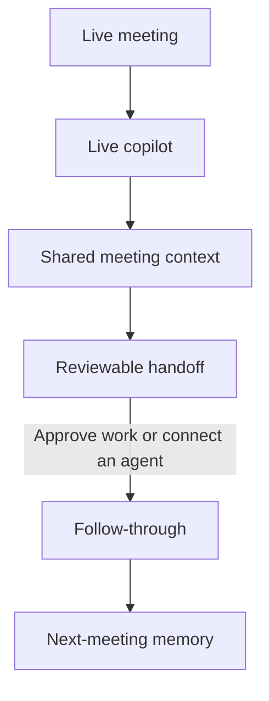
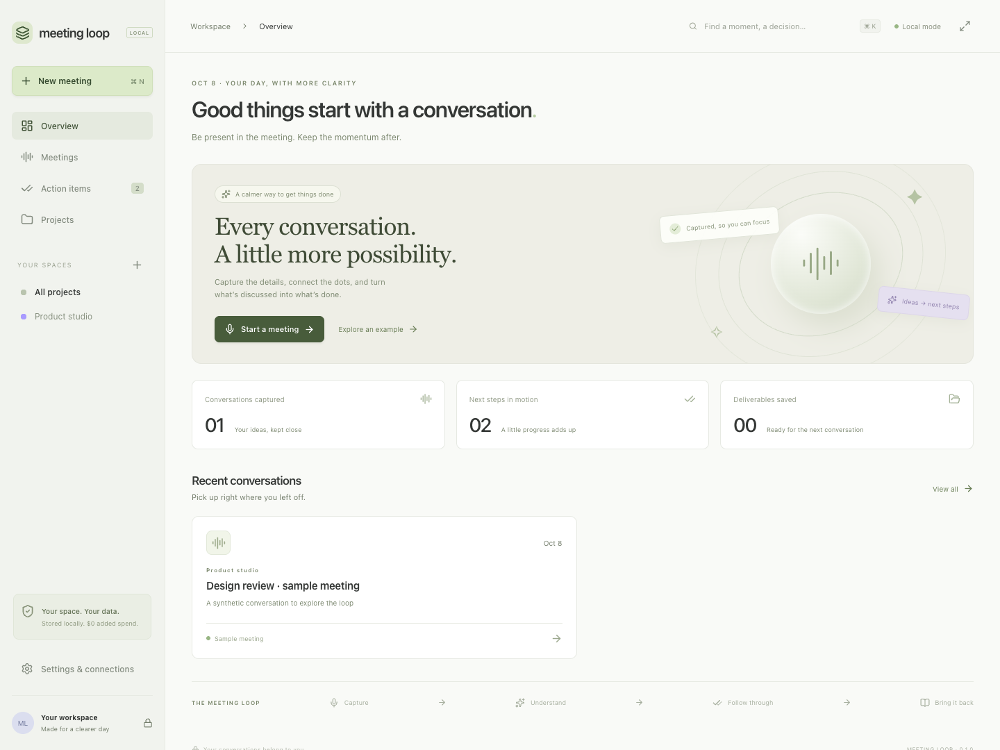
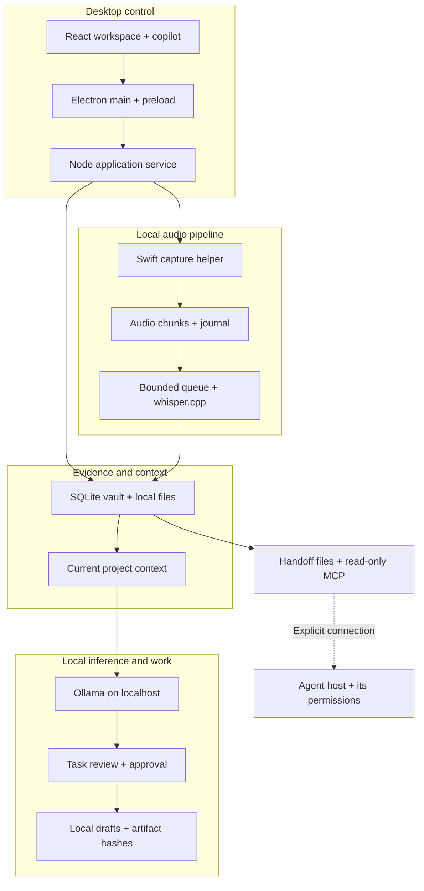
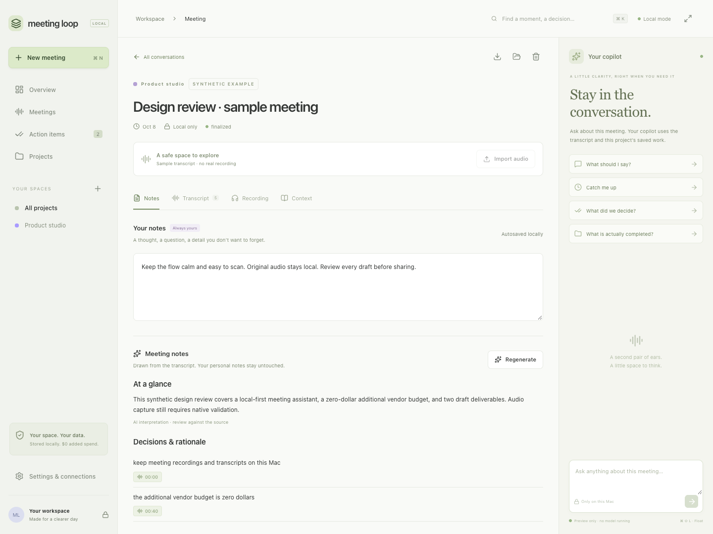
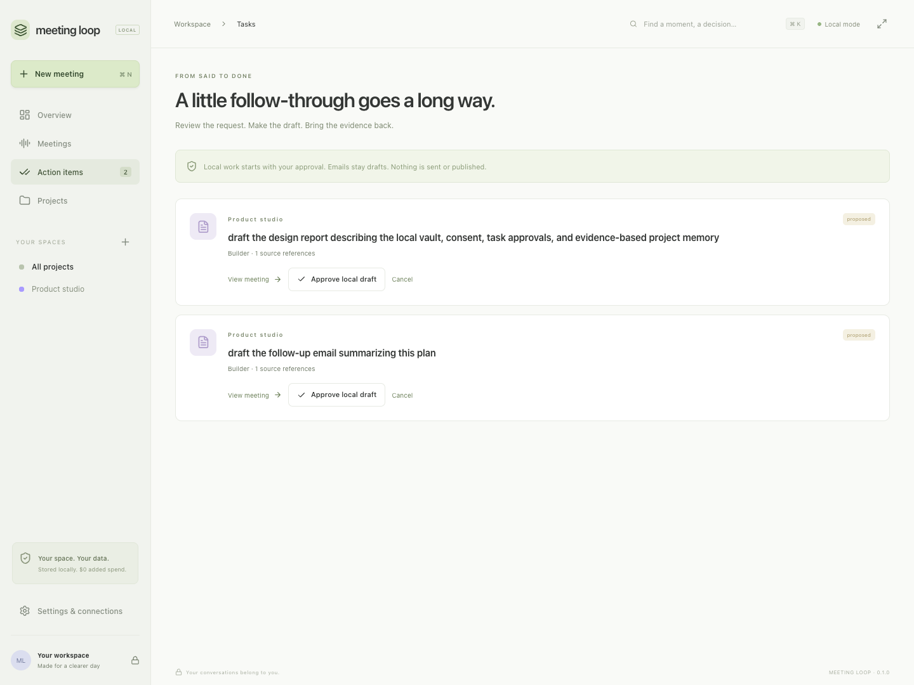

# Meeting Loop

**A macOS meeting copilot for live assistance, shared context and agent-ready follow-through.** Get help with what to say, catch up on the discussion, and ask questions using the meeting transcript and your project's saved work. When the meeting ends, carry that context into a structured handoff so the next agent or approved local workflow can pick up with the sources, decisions and task state intact.

## The loop at a glance



## Why I built it

When I started working in industry, back-to-back meetings left me manually carrying context from one conversation to the next. I wanted meeting context to flow into agents, and their progress to come back into the next meeting for review. That was the idea behind Meeting Loop: a reviewable loop where work could keep moving between meetings.

## What it does today

**During:** the copilot can suggest a response, catch you up, recall decisions and explain what work is actually saved. **After:** Meeting Loop prepares tasks plus source references for review and handoff. **Next time:** the copilot draws on current project state and checked artifacts, including cancellations and changed outputs.

Local follow-through creates approved drafts. An explicitly connected agent can read the handoff through MCP or readable vault exports and carry out further work under its own host permissions.

**Stack:** React · Electron · Swift · SQLite · Ollama · whisper.cpp. The default content path stays on your Mac, with no API key or paid cloud fallback required.

The workspace brings recent conversations, project context and pending action items together, so the next meeting starts with the work already in view.



*The actual React workspace using the built-in fictional example. [Capture scope](docs/SCREENSHOTS.md)*

[Detailed architecture](docs/ARCHITECTURE.md) · [Demo walkthrough](docs/DEMO.md) · [Feature status](STATUS.md) · [Privacy](docs/PRIVACY.md)

## How the pieces work

The application service connects the desktop UI, native capture, local models and durable meeting state. The diagram follows the local data paths and the interface for an explicitly connected agent.



- **Capture survives the model pipeline.** The Swift helper writes audio chunks and a recovery journal before transcription. A bounded queue and retry/recovery handling keep capture and slower transcription separate.
- **Context is assembled from evidence.** The application combines recent transcript segments, personal notes, selected references and the project brief for local inference. Live answers and generated notes return to the workspace; only proposed work goes through task approval. Human notes remain separate from generated interpretations.
- **Follow-through leaves a checkable record.** Approved local drafts are saved back into the vault with hashes and source/run revisions. Project briefs recheck those artifacts before presenting saved work in the next meeting; cancellations and changed evidence override stale context.
- **The handoff carries the context forward.** Revisioned Markdown/JSON exports and five MCP read tools give a configured agent the sources, current task state and saved work.

The diagram omits return arrows to keep the main paths readable: answers stream back to React, and draft artifacts update the same vault and project brief. See the [detailed architecture](docs/ARCHITECTURE.md) for module paths, exported handoff files and execution boundaries.

## What I built

### Live help with the meeting in context

- **Meetings and projects:** an overview, project grouping, local search, meeting detail views, appearance settings and keyboard shortcuts.
- **Live copilot:** a compact always-on-top panel with selectable meeting context, streamed answers and cancellation. Built-in prompts include **What should I say?**, **Catch me up**, **What did we decide?**, and **What is actually completed?** Answers draw on available transcript segments, human notes, project references and the current project brief.
- **Human notes alongside AI notes:** personal notes autosave independently; generated summaries, decisions and questions are versioned and linked to transcript moments. Regenerating a summary does not replace what you wrote.
- **Editable evidence:** timestamped transcript segments, corrections that retain the original source, audio playback and source navigation.

The meeting view keeps your own notes, source transcript and generated interpretation close to the copilot. The preview below shows that separation using the authored example, with the copilot prompts beside the notes.



*Human notes remain separate from the sample meeting summary, while the copilot stays beside the conversation.*

### Local capture, transcription and context

- **Native capture:** a Swift helper with consent and device/source controls, durable audio chunks, recovery journals and orderly shutdown handling.
- **Transcription pipeline:** a bounded local queue, retry/recovery handling and duplicate-segment checks around whisper.cpp.
- **Imports and references:** local audio/transcript import, explicit text/PDF reference imports, and local screenshot selection/preview. Reference hashes detect changed content; screenshot pixels are not interpreted by the text model.
- **Project memory:** project-scoped lexical search and briefs that combine meeting evidence, task state and checked deliverables. Cancelled requests remain cancelled when older transcripts are revisited.

### Agent-ready handoff and follow-through

- **Structured handoff:** finalizing a meeting records a durable `meeting.finalized` event and exports a brief, task records, source index and revisioned manifest. The UI also exposes **Prepare meeting handoff**; later task/notes updates refresh the exported context.
- **Context for another agent:** a configured assistant can read the project brief, transcript and task state through MCP, or inspect the local Markdown/JSON exports. This supplies a starting point for user-authorized work beyond the meeting.
- **Evidence-linked action items:** conservative source checks connect an action and owner to the transcript. Repeated extraction preserves task identity instead of creating the same commitment again.
- **Explicit approval:** a proposed task must be approved before local draft creation. Cancellation and revision checks reject late results based on stale context.
- **Saved drafts:** report/design proposals and **UNSENT** email drafts are stored as local artifacts for review. Code and design suggestions remain proposals until separately implemented and tested.
- **Verifiable handoff:** artifact hashes, run records and source revisions distinguish a saved draft from a claim that work was completed. Changed artifacts lose verified status in the next-meeting brief.

That review step is visible in the action list: each proposed draft carries its project and source reference, with an explicit approval control before local work can start.



*Two fictional proposals await review before local draft creation.*

### A desktop boundary around the data

The Electron renderer uses context isolation with Node integration disabled. The preload interface exposes named methods; the main process checks callers and local paths. The vault supports exports, consistent backups, core restore and managed deletion. A read-only MCP server exposes search, transcript, brief and task-reading tools to an explicitly configured client.

Vault files are stored unencrypted. See [privacy and data handling](docs/PRIVACY.md) for storage, sharing and backup details.

## Built-in connections

| Connection | What it does in this implementation |
| --- | --- |
| **Ollama** | Local streamed answers, summaries and draft proposals using available meeting/project context |
| **whisper.cpp** | Local audio transcription feeding timestamped evidence into the vault |
| **Read-only MCP** | Gives an explicitly configured agent five tools: `search_meetings`, `read_transcript`, `read_project_brief`, `list_tasks`, and `read_task` |
| **Readable handoff files** | Exports the brief, tasks and source references as Markdown/JSON so another tool can consume the context |
| **Official Codex adapter** | Optional version-gated account/model/quota inspection; generation and automatic cloud execution remain disabled |

Connecting a cloud assistant through MCP shares the vault text that client reads. Configure that connection explicitly; [privacy and data flow](docs/PRIVACY.md) describes the boundary.

## Design choices

Three ideas guide the implementation:

1. **Keep evidence separate from interpretation.** Original transcript material, human notes and generated notes have distinct roles and revisions.
2. **Keep review in the loop.** Tasks travel with source revisions and current state, with approval, drafting and completion recorded as distinct steps.
3. **Carry checked state forward.** The next meeting uses current task status and rechecked artifacts, including cancellations and changes, rather than trusting an old summary.

Built by Ved as a personal project, with AI assistance during development. The source includes a fictional example so the workflow can be explored without a real recording.

## Try the example

After launching the desktop app, select **Explore an example**. Open the fictional Alex/Maya design review, add a personal note, switch between notes and transcript, inspect its two action items, and explore the floating copilot and settings.

Browsing the example needs no model download or recording permission. Generating new notes, answers or drafts needs the separately provisioned local runtimes. [Step-by-step demo](docs/DEMO.md)

## Run locally

The development target is **Apple Silicon macOS**, Swift command-line tools and a Node runtime with `node:sqlite`. Recorded checks used Node 23.9.0 and Swift 6.3.2. The Swift package declares macOS 13+, but the full app has not been validated across OS versions or Intel Macs; some runtime paths assume `/opt/homebrew`.

Review the lockfile and installation scripts before setup:

```sh
npm ci --ignore-scripts
# If Electron's binary is absent, review its installer before running:
node node_modules/electron/install.js
npm run native:build
npm run build
npm start
```

The default vault is `~/MeetingLoopVault`. Set `MEETING_LOOP_VAULT` in your shell to choose another private directory outside the repository. The app does not load `.env` automatically; [.env.example](.env.example) documents this setting without credentials.

For inference and audio conversion, provision Ollama, whisper.cpp and FFmpeg separately. The default models are `qwen3:4b-instruct` and pinned Whisper `base.en`:

```sh
node scripts/model-setup.mjs --help
node scripts/model-setup.mjs
```

The default command checks readiness. Explicit `--download` and `--install-runtime` modes can download about 2.65 GB of models or install a runtime; review the script before using them.

## Engineering evidence and scope

Recorded validation includes **45 passing synthetic unit/integration tests**, frontend and Swift builds, and **11 passing provider regression tests** after the schema-notice update. [Validation record and commands](docs/VALIDATION.md)

The screenshots exercise the actual React frontend with synthetic state; native capture and local inference were not run for these images. Live-call endurance, device/sleep behavior, clean-machine setup, accessibility and output quality still need evaluation. [Screenshot method](docs/SCREENSHOTS.md)

Use synthetic fixtures for development; keep personal vaults, recordings and credentials outside Git.

Third-party attributions and the original-code rights status are recorded in [LICENSES.md](LICENSES.md). No open-source license is granted for the original code by this repository.
