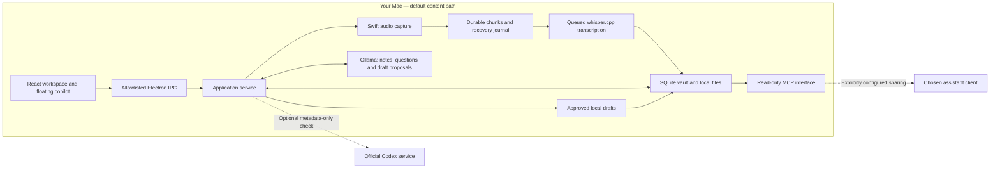

# Meeting Loop

**A local-first meeting copilot for macOS that carries a conversation through to the work that follows.** Capture consented audio, keep your own notes, ask questions against transcript evidence, and turn approved action items into local drafts you can revisit in the next meeting.

Built with **React, Electron, Swift and SQLite**, with **Ollama** for local language-model inference and **whisper.cpp** for transcription. Meeting content stays on your Mac in the default workflow; no API key or paid cloud fallback is required.

## How it fits together



The desktop interface talks to a small set of allowed application commands. Audio is written into recoverable chunks before queued transcription adds evidence to the vault. The application combines that evidence with personal notes, project references and current task state for local answers and drafts. Saved artifacts feed the project brief for the next conversation.

The dotted paths are optional boundaries: a configured MCP client can read selected vault content, and a user-initiated Codex check can retrieve account/model metadata. **Cloud generation is disabled.** Neither connection is needed to browse the example meeting. [More on the architecture](docs/ARCHITECTURE.md) · [Privacy and data flow](docs/PRIVACY.md)

## What I built

### A workspace for the whole meeting

- **Meetings and projects:** an overview, project grouping, local search, meeting detail views, appearance settings and keyboard shortcuts.
- **Floating copilot:** a compact always-on-top panel with meeting context, streamed answers and cancellation, alongside the main workspace.
- **Human notes alongside AI notes:** personal notes autosave independently; generated summaries, decisions and questions are versioned and linked to transcript moments. Regenerating a summary does not replace what you wrote.
- **Editable evidence:** timestamped transcript segments, corrections that retain the original source, audio playback and source navigation.

### Local capture, transcription and context

- **Native capture:** a Swift helper with consent and device/source controls, durable audio chunks, recovery journals and orderly shutdown handling.
- **Transcription pipeline:** a bounded local queue, retry/recovery handling and duplicate-segment checks around whisper.cpp.
- **Imports and references:** local audio/transcript import, explicit text/PDF reference imports, and local screenshot selection/preview. Reference hashes detect changed content; screenshot pixels are not interpreted by the text model.
- **Project memory:** project-scoped lexical search and briefs that combine meeting evidence, task state and checked deliverables. Cancelled requests remain cancelled when older transcripts are revisited.

### From commitment to reviewable work

- **Evidence-linked action items:** conservative source checks connect an action and owner to the transcript. Repeated extraction preserves task identity instead of creating the same commitment again.
- **Explicit approval:** a proposed task must be approved before local draft creation. Cancellation and revision checks reject late results based on stale context.
- **Saved drafts:** report/design proposals and email drafts are stored as local artifacts. Email remains **UNSENT**, with no inferred recipient and no sending connector. Generated code or design suggestions are proposals, not executed or externally verified work.
- **Verifiable handoff:** artifact hashes, run records and source revisions distinguish a saved draft from a claim that work was completed. Changed artifacts lose verified status in the next-meeting brief.

### A desktop boundary around the data

The Electron renderer uses context isolation with Node integration disabled. The preload interface exposes named methods; the main process checks callers and local paths. The vault supports exports, consistent backups, core restore and managed deletion. A read-only MCP server exposes search, transcript, brief and task-reading tools to an explicitly configured client.

These are implemented controls, not a claim of comprehensive security certification. Local storage is not encryption. [Feature status and boundaries](STATUS.md)

## Design choices

Three ideas guide the implementation:

1. **Keep evidence separate from interpretation.** Original transcript material, human notes and generated notes have distinct roles and revisions.
2. **Treat approval, drafting and completion as different states.** A model response cannot grant permission, prove tests passed or claim an email was sent.
3. **Carry checked state forward.** The next meeting uses current task status and rechecked artifacts, including cancellations and changes, rather than trusting an old summary.

Built by Ved as a personal project, with AI assistance during development. The source includes a fictional example so the workflow can be explored without a real recording.

## Try the example

After launching the desktop app, select **Explore an example**. Open the fictional Alex/Maya design review, add a personal note, switch between notes and transcript, inspect its two action items, and explore the floating copilot and settings.

Browsing the example needs no model download or recording permission. Generating new notes, answers or drafts needs the separately provisioned local runtimes. [Step-by-step demo](docs/DEMO.md)

## Run locally

The development target is **Apple Silicon macOS**, Swift command-line tools and a Node runtime with `node:sqlite`. Recorded checks used Node 23.9.0 and Swift 6.3.2. The Swift package declares macOS 13+, but the full app has not been validated across OS versions or Intel Macs; some runtime paths assume `/opt/homebrew`.

Review the lockfile and installation scripts before setup:

```sh
npm ci --ignore-scripts
# If Electron's binary is absent, review its installer before running:
node node_modules/electron/install.js
npm run native:build
npm run build
npm start
```

The default vault is `~/MeetingLoopVault`. Set `MEETING_LOOP_VAULT` in your shell to choose another private directory outside the repository. The app does not load `.env` automatically; [.env.example](.env.example) documents this setting without credentials.

For inference and audio conversion, provision Ollama, whisper.cpp and FFmpeg separately. The default models are `qwen3:4b-instruct` and pinned Whisper `base.en`:

```sh
node scripts/model-setup.mjs --help
node scripts/model-setup.mjs
```

The default command checks readiness. Explicit `--download` and `--install-runtime` modes can download about 2.65 GB of models or install a runtime; review the script before using them. A fresh-machine installation has not been verified.

## Engineering evidence and scope

The recorded validation includes **45 passing synthetic unit/integration tests**, frontend and Swift builds, and **11 passing provider regression tests** after the schema-notice update. These are existing results, not a claim of real-call acceptance. [Validation record and commands](docs/VALIDATION.md)

Meeting Loop is a personal prototype. Live-call endurance, device/sleep behavior, clean-machine setup, accessibility and output-quality evaluation remain unvalidated. The latest restricted environment could not launch Electron or reach local inference, so no fresh UI screenshot is presented as verified evidence. Search is lexical; general-purpose task execution and external publishing connectors are outside the implemented scope.

Use synthetic fixtures for development and demonstrations. Keep recordings, transcripts, vaults and credentials outside Git. Preserve evidence and human notes when changing the application, and update documentation when verified behavior changes.

Third-party attributions and the original-code rights status are recorded in [LICENSES.md](LICENSES.md). No open-source license is granted for the original code by this repository.
