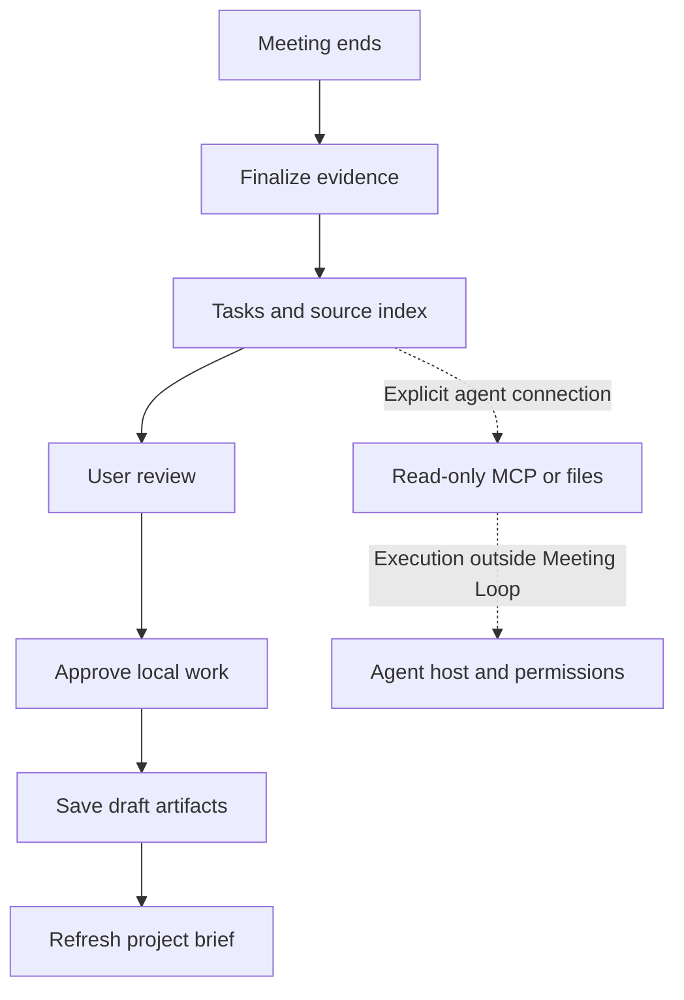

# Architecture and engineering decisions

Meeting Loop separates the user interface, application rules, durable evidence, native capture, and model adapters. It is a local desktop prototype; there is no hosted application backend.

| Layer | Source | Responsibility |
| --- | --- | --- |
| React interface | `src/main.jsx`, `src/style.css` | Meeting overview, notes, transcripts, task review, settings and floating copilot |
| Electron boundary | `desktop/main.mjs`, `desktop/preload.cjs` | Isolated renderer, explicit IPC methods, trusted window checks and local media access |
| Application service | `server/application.mjs` | Notes, question answering, approvals, drafts, inference cancellation and orchestration |
| Vault | `server/core/vault.mjs` | SQLite state, source evidence, revisions, scoped paths, search and artifact checksums |
| Capture | `native/capture-helper/`, `server/capture-runtime.mjs` | Native capture lifecycle, durable audio chunks, journals and recovery |
| Providers | `server/providers/` | Local Ollama and whisper.cpp, plus separately gated read-only Codex metadata |
| MCP | `server/mcp.mjs` | Read-only access to selected local evidence for an explicitly configured client |

## Preserve evidence before interpretation

Audio chunks and recovery journals make interrupted capture recoverable in tested synthetic cases. Transcript corrections retain original evidence. Human notes are stored separately from generated notes, which are versioned and linked to source segments. This prevents regeneration from silently replacing what the user wrote.

The application constrains extracted actions and decisions using source evidence. These checks reduce unsupported output, but do not establish complete extraction accuracy or clinical reliability. Complex wording and relative dates remain limitations.

## Live context and agent handoff

The copilot's question path combines recent transcript segments, the meeting's personal notes, selected project references and the current project brief. The brief rechecks saved artifacts and distinguishes outstanding commitments from saved drafts. Cancelled tasks are carried as overriding context so an old transcript does not revive them. Quick prompts support suggested replies, catch-up, decision recall and saved-work status; output streams to the main interface or floating panel.

Finalization records a durable, deduplicated `meeting.finalized` event and prepares a handoff tied to the transcript revision. The handoff directory contains:

| File | Role |
| --- | --- |
| `manifest.json` | Stable meeting/event/project identity, source revision and task IDs |
| `brief.md` | Human-readable task summary and execution boundaries |
| `tasks.json` | Proposed work, ownership and current task state |
| `source-index.json` | References to the versioned transcript and personal notes |

The exports refresh when relevant tasks or generated notes change. Project briefs separately recheck artifact hashes and expose current decisions, saved deliverables and outstanding work.

The MCP interface exposes five read tools: `search_meetings`, `read_transcript`, `read_project_brief`, `list_tasks`, and `read_task`. It can supply another agent with the context for work, but does not start that agent, approve execution, accept completion writes or automatically register a cloud client. Any external agent's actions use its host's tools and permissions. The file exports offer a second, directly readable handoff surface.

## Approval and follow-through

The built-in executor runs after explicit local approval and creates reviewable report/design proposals or unsent email drafts. It is not a general-purpose shell/research executor. Email drafts have no inferred recipient and there is no send operation. Run records do not invent code execution, passed tests or external confirmation.

A completed local draft is stored with artifact hashes and source/run metadata. The project brief rechecks artifacts and context before the next meeting: changed files cannot retain verified completion evidence, and cancellations take precedence over stale generated requests. A matching hash establishes file integrity, not the truth or quality of the content.

## Keep the default data path local

The renderer has no Node integration, uses context isolation, and calls an allowlisted preload interface. The main process validates caller windows and constrains local media access. Vault operations reject unsafe paths and symlinks in tested cases. These are specific controls, not a complete security audit.

Ollama and whisper.cpp perform local inference. No cloud generation or paid fallback is enabled. A user-initiated Codex connection check is metadata-only and can contact an external service. The MCP server is read-only but can expose vault text to its client; connecting a cloud client requires a separate scope decision.

## Deliberate limits

Search uses a project-filtered lexical fallback because the checked SQLite runtime lacked FTS5; it is not semantic search. The native system-audio mode used by the UI is not equivalent to selecting one meeting application. Diarization, overlap handling, long-call acceptance, image reasoning, broad connector execution and notarized distribution remain outside demonstrated coverage.

The [feature-status page](../STATUS.md) describes the current product boundaries. [Validation](VALIDATION.md) distinguishes current execution from historical development observations.
